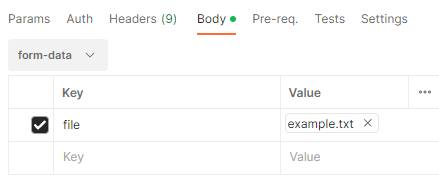

# TestTaskAPI
## Описание
REST API для разбора файла на составные части. Файл парсится построчно и анализируется. В начале каждой строки может быть признак начала раздела или подраздела - символ '#'. Количество символов '#' в начале строки указывает на уровень вложенности раздела.  
Результатом идет разобранный файл в виде набора строк + структура разделов. API принимает по 1 файлу, сохраняя полученные данные в базе.   
В директории /postman находится postman-коллекция.

## Перед запуском
Необходимо установить PostgreSQL Service, порт 5432. Создать пользователя. Имя и пароль внести в файл ```src/main/resources/application.yaml```.  Создать базу данных под названием ```paragraphs```.

## Входные данные
API принимает на вход текстовый файл с возможными переводами строк в стиле CRLF, CR и/или LF и с ограничением в 1 Мб. HTTP-заголовок ```Content-Type``` должен иметь значение ```form-data```.  
Входные данные считаются корректными по уровням вложенности, если не допускаются ситуации:
- ```
  #{любая строка}
  {строки без ## в начале}
  ###{любая строка}
  ```
- ```
  ##{первая строка в файле} //аналогично для 3 и более # в начале первой строки
  ```

## Выходные данные
В зависимости от запроса меняется формат выходных данных.
```
GET: http://localhost:8080/paragraphs/info
```
Выполняя запрос, ответ получаем в виде списка:
```
[
    {
        "fileName": "example.txt",
        "id": 1,
        "value": "first string",
        "lineNumber": 1,
        "children": []
    },
    ...
    {
        "fileName": "example.txt",
        "id": n,
        "value": "last string",
        "lineNumber": n,
        "children": []
    }
]
```
Номер строки и id не обязательно совпадают.  
Если имеются разделы или подразделы в тексте, то выходные данные могут принять вид:
```
[
    {
        "fileName": "example.txt",
        "id": 10,
        "value": "#Первый раздел",
        "lineNumber": 1,
        "children": [
            {
                "fileName": "example.txt",
                "id": 20,
                "value": "строка без # в начале",
                "lineNumber": 2,
                "children": []
            },
            {
                "fileName": "example.txt",
                "id": 30,
                "value": "##Второй раздел",
                "lineNumber": 3,
                "children": [
                    {
                        "fileName": "example.txt",
                        "id": 136,
                        "value": "###Третий раздел",
                        "lineNumber": 4,
                        "children": []
                    },
                    {
                        "fileName": "example.txt",
                        "id": 137,
                        "value": "###Еще один третий раздел",
                        "lineNumber": 5,
                        "children": []
                    }
                ]
            }
        ]
    },
    ...
]
```
Если необходимо получить информацию по заданному id, то:
```
GET: http://localhost:8080/paragraphs/{id}
```
```
{
    "fileName": "example.txt",
    "id": {id},
    "value": "smth string",
    "lineNumber": 1,
    "children": []
}
```
После отправки файла по запросу POST, возможны несколько вариантов ответа:
```
POST: http://localhost:8080/paragraphs
```
```
{
    "fileName": "example.txt",
    "success": "success",
    "countLines": 13
}
```
```
{
    "fileName": "check-mark.png",
    "success": "Неверный формат запроса, подайте на вход текстовый файл",
    "countLines": -1
}
```
Или, например, сообщение об ошибке:
```
Количество # превышает в строке {номер_строки} как минимум на 1. Проверьте корректность ввода.
```
## Пример запуска
```
POST: http://localhost:8080/paragraphs
```
  
Результат при запросе ```GET: http://localhost:8080/paragraphs/info``` можно посмотреть в файле ```result.txt```  

